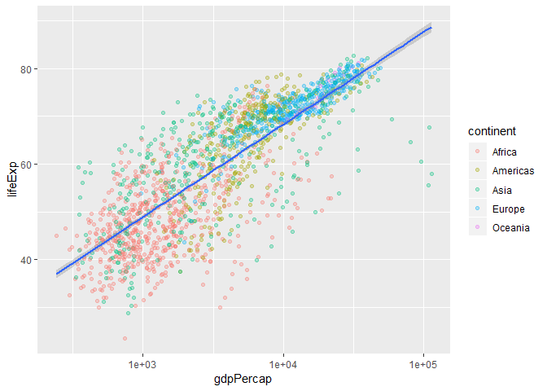

R Markdown
----------

This is the R Markdown document for hw02, which is a continuation of
hw01 - further exploring the gapminder dataset. To explore the data this
time around, we will be using the
[*dplyr*](https://cran.r-project.org/web/packages/dplyr/vignettes/dplyr.html)
package. Functons such as *filter()*, *select()*, and *piping (%&gt;%)*
will be used to explore categorical and quantitative variables on their
own, and also explore their potential relationships.

  *For additional information on functions used in this exercise,
type "?" and the function as one word in the console and the R help
documentation will explain the function and the object needed to run the
function successfully*

 

Viewing and Exploring the Dataset
---------------------------------

We can load the dataset into our R-Studio environment through
**library(gapminder)**. Likewise, we will load the tidyverse package
through **library(tidyverse)**, which will import the dplyr package.

    library(gapminder)
    library(tidyverse)

 

Smell Test the Data
-------------------

Let's start by exploring the gapminder object:

    str(gapminder)

    ## Classes 'tbl_df', 'tbl' and 'data.frame':    1704 obs. of  6 variables:
    ##  $ country  : Factor w/ 142 levels "Afghanistan",..: 1 1 1 1 1 1 1 1 1 1 ...
    ##  $ continent: Factor w/ 5 levels "Africa","Americas",..: 3 3 3 3 3 3 3 3 3 3 ...
    ##  $ year     : int  1952 1957 1962 1967 1972 1977 1982 1987 1992 1997 ...
    ##  $ lifeExp  : num  28.8 30.3 32 34 36.1 ...
    ##  $ pop      : int  8425333 9240934 10267083 11537966 13079460 14880372 12881816 13867957 16317921 22227415 ...
    ##  $ gdpPercap: num  779 821 853 836 740 ...

    class(gapminder)

    ## [1] "tbl_df"     "tbl"        "data.frame"

    typeof(gapminder)

    ## [1] "list"

 

The *str* function gives the internal structure of the gapminder object.
From the R-output, we can see that the gapminder dataset is a data frame
with 6 variables/columns and 1706 observations/rows. The *str* function
will also denote the class of each variable in the gapminder dataset (in
our situation: Factor for country and continent, integer for year and
population, and numerical for life expectancy)

 

The gapminder object is stored in memory of a **list** and the gapminder
has an abstract type of a **data frame**

 

There are other ways or functions we can use to find the structure of
the dataset and information about the variables within the data frame:

    ncol(gapminder)

    ## [1] 6

    nrow(gapminder)

    ## [1] 1704

    names(gapminder)

    ## [1] "country"   "continent" "year"      "lifeExp"   "pop"       "gdpPercap"

    data <- gapminder

 

As observed, the functions *ncol* and *nrow* gives you the number of
columns and rows of the dataset respectively, while the *name* function
will give you the names of the variables in the dataset with the correct
order.

 

Lastly you can also try assigning the gapminder dataset to a variable
*(named data in this scenario)* in your console, and then the top right
area of your **R-Studio Global Environment** will give you the number of
observations and number of variables in the gapminder dataset.

 

Lets now explore the data type of each variable in the gapminder
dataset:

    class(gapminder$country)

    ## [1] "factor"

    class(gapminder$continent)

    ## [1] "factor"

    class(gapminder$year)

    ## [1] "integer"

    class(gapminder$lifeExp)

    ## [1] "numeric"

    class(gapminder$pop)

    ## [1] "integer"

    class(gapminder$gdpPercap)

    ## [1] "numeric"

    lapply(gapminder, class)

    ## $country
    ## [1] "factor"
    ## 
    ## $continent
    ## [1] "factor"
    ## 
    ## $year
    ## [1] "integer"
    ## 
    ## $lifeExp
    ## [1] "numeric"
    ## 
    ## $pop
    ## [1] "integer"
    ## 
    ## $gdpPercap
    ## [1] "numeric"

 

You can isolate each variable in the dataset by adding the '$' sign next
the the gapminder dataset and then typing out the variable of your
interest. You can do this for each variable and find their class as seen
above.

 

However, the *lapply()* function will save you time of typing each
variable out and give you the same output by listing all variables in
the dataset and their class. The *lapply()* function traverses over a
set of data like a list or vector, and calls the specified function for
each item and provides its output.

 

Exploring the Variables
-----------------------

Lets explore the variables in the gapminder dataset. There are 6
variables: country, continent, year, life expectancy, population, and
GDP per capita.

### Country

    table(gapminder$country)

    ## 
    ##              Afghanistan                  Albania                  Algeria 
    ##                       12                       12                       12 
    ##                   Angola                Argentina                Australia 
    ##                       12                       12                       12 
    ##                  Austria                  Bahrain               Bangladesh 
    ##                       12                       12                       12 
    ##                  Belgium                    Benin                  Bolivia 
    ##                       12                       12                       12 
    ##   Bosnia and Herzegovina                 Botswana                   Brazil 
    ##                       12                       12                       12 
    ##                 Bulgaria             Burkina Faso                  Burundi 
    ##                       12                       12                       12 
    ##                 Cambodia                 Cameroon                   Canada 
    ##                       12                       12                       12 
    ## Central African Republic                     Chad                    Chile 
    ##                       12                       12                       12 
    ##                    China                 Colombia                  Comoros 
    ##                       12                       12                       12 
    ##         Congo, Dem. Rep.              Congo, Rep.               Costa Rica 
    ##                       12                       12                       12 
    ##            Cote d'Ivoire                  Croatia                     Cuba 
    ##                       12                       12                       12 
    ##           Czech Republic                  Denmark                 Djibouti 
    ##                       12                       12                       12 
    ##       Dominican Republic                  Ecuador                    Egypt 
    ##                       12                       12                       12 
    ##              El Salvador        Equatorial Guinea                  Eritrea 
    ##                       12                       12                       12 
    ##                 Ethiopia                  Finland                   France 
    ##                       12                       12                       12 
    ##                    Gabon                   Gambia                  Germany 
    ##                       12                       12                       12 
    ##                    Ghana                   Greece                Guatemala 
    ##                       12                       12                       12 
    ##                   Guinea            Guinea-Bissau                    Haiti 
    ##                       12                       12                       12 
    ##                 Honduras         Hong Kong, China                  Hungary 
    ##                       12                       12                       12 
    ##                  Iceland                    India                Indonesia 
    ##                       12                       12                       12 
    ##                     Iran                     Iraq                  Ireland 
    ##                       12                       12                       12 
    ##                   Israel                    Italy                  Jamaica 
    ##                       12                       12                       12 
    ##                    Japan                   Jordan                    Kenya 
    ##                       12                       12                       12 
    ##         Korea, Dem. Rep.              Korea, Rep.                   Kuwait 
    ##                       12                       12                       12 
    ##                  Lebanon                  Lesotho                  Liberia 
    ##                       12                       12                       12 
    ##                    Libya               Madagascar                   Malawi 
    ##                       12                       12                       12 
    ##                 Malaysia                     Mali               Mauritania 
    ##                       12                       12                       12 
    ##                Mauritius                   Mexico                 Mongolia 
    ##                       12                       12                       12 
    ##               Montenegro                  Morocco               Mozambique 
    ##                       12                       12                       12 
    ##                  Myanmar                  Namibia                    Nepal 
    ##                       12                       12                       12 
    ##              Netherlands              New Zealand                Nicaragua 
    ##                       12                       12                       12 
    ##                    Niger                  Nigeria                   Norway 
    ##                       12                       12                       12 
    ##                     Oman                 Pakistan                   Panama 
    ##                       12                       12                       12 
    ##                 Paraguay                     Peru              Philippines 
    ##                       12                       12                       12 
    ##                   Poland                 Portugal              Puerto Rico 
    ##                       12                       12                       12 
    ##                  Reunion                  Romania                   Rwanda 
    ##                       12                       12                       12 
    ##    Sao Tome and Principe             Saudi Arabia                  Senegal 
    ##                       12                       12                       12 
    ##                   Serbia             Sierra Leone                Singapore 
    ##                       12                       12                       12 
    ##          Slovak Republic                 Slovenia                  Somalia 
    ##                       12                       12                       12 
    ##             South Africa                    Spain                Sri Lanka 
    ##                       12                       12                       12 
    ##                    Sudan                Swaziland                   Sweden 
    ##                       12                       12                       12 
    ##              Switzerland                    Syria                   Taiwan 
    ##                       12                       12                       12 
    ##                 Tanzania                 Thailand                     Togo 
    ##                       12                       12                       12 
    ##      Trinidad and Tobago                  Tunisia                   Turkey 
    ##                       12                       12                       12 
    ##                   Uganda           United Kingdom            United States 
    ##                       12                       12                       12 
    ##                  Uruguay                Venezuela                  Vietnam 
    ##                       12                       12                       12 
    ##       West Bank and Gaza              Yemen, Rep.                   Zambia 
    ##                       12                       12                       12 
    ##                 Zimbabwe 
    ##                       12

    length(table(gapminder$country))

    ## [1] 142

 

There are 142 unique countries in the gapminder data set, and each
country has 12 observations.

### Continent

    table(gapminder$continent)

    ## 
    ##   Africa Americas     Asia   Europe  Oceania 
    ##      624      300      396      360       24

    table(gapminder$continent)/nrow(gapminder) * 100

    ## 
    ##    Africa  Americas      Asia    Europe   Oceania 
    ## 36.619718 17.605634 23.239437 21.126761  1.408451

 

Over one third of the countries in the gapminder dataset were from
Africa (36.6%), while the Oceania region had the lowest number of
observations (1.4%).

### Year

    table(gapminder$year)

    ## 
    ## 1952 1957 1962 1967 1972 1977 1982 1987 1992 1997 2002 2007 
    ##  142  142  142  142  142  142  142  142  142  142  142  142

    length(table(gapminder$year))

    ## [1] 12

    summary(gapminder$year)

    ##    Min. 1st Qu.  Median    Mean 3rd Qu.    Max. 
    ##    1952    1966    1980    1980    1993    2007

 

The gapminder dataset collects one observation for each country every 5
years, with the first timepoint starting in 1952. Data was collected
onwards all the way to 2007, for a total of 12 observations for each
country.

### Life Expectancy

    summary(gapminder$lifeExp)

    ##    Min. 1st Qu.  Median    Mean 3rd Qu.    Max. 
    ##   23.60   48.20   60.71   59.47   70.85   82.60

    tapply(gapminder$lifeExp, gapminder$country, summary) 

    ## $Afghanistan
    ##    Min. 1st Qu.  Median    Mean 3rd Qu.    Max. 
    ##   28.80   33.51   39.15   37.48   41.70   43.83 
    ## 
    ## $Albania
    ##    Min. 1st Qu.  Median    Mean 3rd Qu.    Max. 
    ##   55.23   65.87   69.68   68.43   72.24   76.42 
    ## 
    ## $Algeria
    ##    Min. 1st Qu.  Median    Mean 3rd Qu.    Max. 
    ##   43.08   50.63   59.69   59.03   68.10   72.30 
    ## 
    ## $Angola
    ##    Min. 1st Qu.  Median    Mean 3rd Qu.    Max. 
    ##   30.02   35.49   39.69   37.88   40.73   42.73 
    ## 
    ## $Argentina
    ##    Min. 1st Qu.  Median    Mean 3rd Qu.    Max. 
    ##   62.48   65.51   69.21   69.06   72.22   75.32 
    ## 
    ## $Australia
    ##    Min. 1st Qu.  Median    Mean 3rd Qu.    Max. 
    ##   69.12   71.06   74.11   74.66   77.88   81.24 
    ## 
    ## $Austria
    ##    Min. 1st Qu.  Median    Mean 3rd Qu.    Max. 
    ##   66.80   69.99   72.68   73.10   76.41   79.83 
    ## 
    ## $Bahrain
    ##    Min. 1st Qu.  Median    Mean 3rd Qu.    Max. 
    ##   50.94   59.17   67.32   65.61   72.93   75.64 
    ## 
    ## $Bangladesh
    ##    Min. 1st Qu.  Median    Mean 3rd Qu.    Max. 
    ##   37.48   42.89   48.47   49.83   56.87   64.06 
    ## 
    ## $Belgium
    ##    Min. 1st Qu.  Median    Mean 3rd Qu.    Max. 
    ##   68.00   70.77   73.37   73.64   76.73   79.44 
    ## 
    ## $Benin
    ##    Min. 1st Qu.  Median    Mean 3rd Qu.    Max. 
    ##   38.22   44.32   50.05   48.78   54.04   56.73 
    ## 
    ## $Bolivia
    ##    Min. 1st Qu.  Median    Mean 3rd Qu.    Max. 
    ##   40.41   44.63   51.94   52.50   60.48   65.55 
    ## 
    ## $`Bosnia and Herzegovina`
    ##    Min. 1st Qu.  Median    Mean 3rd Qu.    Max. 
    ##   53.82   64.08   70.28   67.71   72.44   74.85 
    ## 
    ## $Botswana
    ##    Min. 1st Qu.  Median    Mean 3rd Qu.    Max. 
    ##   46.63   50.45   52.93   54.60   59.86   63.62 
    ## 
    ## $Brazil
    ##    Min. 1st Qu.  Median    Mean 3rd Qu.    Max. 
    ##   50.92   57.14   62.41   62.24   67.64   72.39 
    ## 
    ## $Bulgaria
    ##    Min. 1st Qu.  Median    Mean 3rd Qu.    Max. 
    ##   59.60   70.12   70.86   69.74   71.23   73.00 
    ## 
    ## $`Burkina Faso`
    ##    Min. 1st Qu.  Median    Mean 3rd Qu.    Max. 
    ##   31.98   39.98   47.13   44.69   50.28   52.30 
    ## 
    ## $Burundi
    ##    Min. 1st Qu.  Median    Mean 3rd Qu.    Max. 
    ##   39.03   43.17   45.03   44.82   47.39   49.58 
    ## 
    ## $Cambodia
    ##    Min. 1st Qu.  Median    Mean 3rd Qu.    Max. 
    ##   31.22   41.10   48.19   47.90   55.99   59.72 
    ## 
    ## $Cameroon
    ##    Min. 1st Qu.  Median    Mean 3rd Qu.    Max. 
    ##   38.52   44.26   49.61   48.13   52.39   54.98 
    ## 
    ## $Canada
    ##    Min. 1st Qu.  Median    Mean 3rd Qu.    Max. 
    ##   68.75   71.92   74.98   74.90   78.12   80.65 
    ## 
    ## $`Central African Republic`
    ##    Min. 1st Qu.  Median    Mean 3rd Qu.    Max. 
    ##   35.46   40.98   44.10   43.87   47.16   50.48 
    ## 
    ## $Chad
    ##    Min. 1st Qu.  Median    Mean 3rd Qu.    Max. 
    ##   38.09   43.13   48.45   46.77   50.75   51.72 
    ## 
    ## $Chile
    ##    Min. 1st Qu.  Median    Mean 3rd Qu.    Max. 
    ##   54.74   59.87   68.81   67.43   74.55   78.55 
    ## 
    ## $China
    ##    Min. 1st Qu.  Median    Mean 3rd Qu.    Max. 
    ##   44.00   56.42   64.75   61.79   69.12   72.96 
    ## 
    ## $Colombia
    ##    Min. 1st Qu.  Median    Mean 3rd Qu.    Max. 
    ##   50.64   59.44   65.24   63.90   68.89   72.89 
    ## 
    ## $Comoros
    ##    Min. 1st Qu.  Median    Mean 3rd Qu.    Max. 
    ##   40.72   45.97   51.94   52.38   58.62   65.15 
    ## 
    ## $`Congo, Dem. Rep.`
    ##    Min. 1st Qu.  Median    Mean 3rd Qu.    Max. 
    ##   39.14   42.47   45.26   44.54   46.70   47.80 
    ## 
    ## $`Congo, Rep.`
    ##    Min. 1st Qu.  Median    Mean 3rd Qu.    Max. 
    ##   42.11   51.14   53.94   52.50   55.83   57.47 
    ## 
    ## $`Costa Rica`
    ##    Min. 1st Qu.  Median    Mean 3rd Qu.    Max. 
    ##   57.21   64.78   72.10   70.18   76.10   78.78 
    ## 
    ## $`Cote d'Ivoire`
    ##    Min. 1st Qu.  Median    Mean 3rd Qu.    Max. 
    ##   40.48   46.36   48.16   48.44   52.13   54.66 
    ## 
    ## $Croatia
    ##    Min. 1st Qu.  Median    Mean 3rd Qu.    Max. 
    ##   61.21   68.16   70.55   70.06   72.82   75.75 
    ## 
    ## $Cuba
    ##    Min. 1st Qu.  Median    Mean 3rd Qu.    Max. 
    ##   59.42   67.53   73.18   71.05   74.85   78.27 
    ## 
    ## $`Czech Republic`
    ##    Min. 1st Qu.  Median    Mean 3rd Qu.    Max. 
    ##   66.87   70.19   70.83   71.51   72.80   76.49 
    ## 
    ## $Denmark
    ##    Min. 1st Qu.  Median    Mean 3rd Qu.    Max. 
    ##   70.78   72.81   74.66   74.37   75.53   78.33 
    ## 
    ## $Djibouti
    ##    Min. 1st Qu.  Median    Mean 3rd Qu.    Max. 
    ##   34.81   41.48   47.67   46.38   51.99   54.79 
    ## 
    ## $`Dominican Republic`
    ##    Min. 1st Qu.  Median    Mean 3rd Qu.    Max. 
    ##   45.93   55.93   62.76   61.55   68.83   72.24 
    ## 
    ## $Ecuador
    ##    Min. 1st Qu.  Median    Mean 3rd Qu.    Max. 
    ##   48.36   56.17   62.83   62.82   70.29   74.99 
    ## 
    ## $Egypt
    ##    Min. 1st Qu.  Median    Mean 3rd Qu.    Max. 
    ##   41.89   48.72   54.66   56.24   64.56   71.34 
    ## 
    ## $`El Salvador`
    ##    Min. 1st Qu.  Median    Mean 3rd Qu.    Max. 
    ##   45.26   54.97   57.45   59.63   67.48   71.88 
    ## 
    ## $`Equatorial Guinea`
    ##    Min. 1st Qu.  Median    Mean 3rd Qu.    Max. 
    ##   34.48   38.61   42.84   42.96   47.72   51.58 
    ## 
    ## $Eritrea
    ##    Min. 1st Qu.  Median    Mean 3rd Qu.    Max. 
    ##   35.93   41.68   44.34   46.00   50.84   58.04 
    ## 
    ## $Ethiopia
    ##    Min. 1st Qu.  Median    Mean 3rd Qu.    Max. 
    ##   34.08   41.60   44.71   44.48   48.42   52.95 
    ## 
    ## $Finland
    ##    Min. 1st Qu.  Median    Mean 3rd Qu.    Max. 
    ##   66.55   69.56   73.54   72.99   76.06   79.31 
    ## 
    ## $France
    ##    Min. 1st Qu.  Median    Mean 3rd Qu.    Max. 
    ##   67.41   71.29   74.36   74.35   77.76   80.66 
    ## 
    ## $Gabon
    ##    Min. 1st Qu.  Median    Mean 3rd Qu.    Max. 
    ##   37.00   43.57   54.68   51.22   57.62   61.37 
    ## 
    ## $Gambia
    ##    Min. 1st Qu.  Median    Mean 3rd Qu.    Max. 
    ##   30.00   35.37   43.71   44.40   53.45   59.45 
    ## 
    ## $Germany
    ##    Min. 1st Qu.  Median    Mean 3rd Qu.    Max. 
    ##   67.50   70.68   73.15   73.44   76.39   79.41 
    ## 
    ## $Ghana
    ##    Min. 1st Qu.  Median    Mean 3rd Qu.    Max. 
    ##   43.15   47.67   52.75   52.34   57.74   60.02 
    ## 
    ## $Greece
    ##    Min. 1st Qu.  Median    Mean 3rd Qu.    Max. 
    ##   65.86   70.63   74.46   73.73   77.24   79.48 
    ## 
    ## $Guatemala
    ##    Min. 1st Qu.  Median    Mean 3rd Qu.    Max. 
    ##   42.02   49.25   57.08   56.73   64.11   70.26 
    ## 
    ## $Guinea
    ##    Min. 1st Qu.  Median    Mean 3rd Qu.    Max. 
    ##   33.61   36.84   41.83   43.24   49.30   56.01 
    ## 
    ## $`Guinea-Bissau`
    ##    Min. 1st Qu.  Median    Mean 3rd Qu.    Max. 
    ##   32.50   35.24   38.40   39.21   43.67   46.39 
    ## 
    ## $Haiti
    ##    Min. 1st Qu.  Median    Mean 3rd Qu.    Max. 
    ##   37.58   45.58   50.69   50.17   55.48   60.92 
    ## 
    ## $Honduras
    ##    Min. 1st Qu.  Median    Mean 3rd Qu.    Max. 
    ##   41.91   50.20   59.16   57.92   66.71   70.20 
    ## 
    ## $`Hong Kong, China`
    ##    Min. 1st Qu.  Median    Mean 3rd Qu.    Max. 
    ##   60.96   69.41   74.53   73.49   78.20   82.21 
    ## 
    ## $Hungary
    ##    Min. 1st Qu.  Median    Mean 3rd Qu.    Max. 
    ##   64.03   68.87   69.54   69.39   70.22   73.34 
    ## 
    ## $Iceland
    ##    Min. 1st Qu.  Median    Mean 3rd Qu.    Max. 
    ##   72.49   73.72   76.55   76.51   78.82   81.76 
    ## 
    ## $India
    ##    Min. 1st Qu.  Median    Mean 3rd Qu.    Max. 
    ##   37.37   46.30   55.40   53.17   60.61   64.70 
    ## 
    ## $Indonesia
    ##    Min. 1st Qu.  Median    Mean 3rd Qu.    Max. 
    ##   37.47   45.10   54.43   54.34   63.52   70.65 
    ## 
    ## $Iran
    ##    Min. 1st Qu.  Median    Mean 3rd Qu.    Max. 
    ##   44.87   51.68   58.66   58.64   66.32   70.96 
    ## 
    ## $Iraq
    ##    Min. 1st Qu.  Median    Mean 3rd Qu.    Max. 
    ##   45.32   53.71   57.93   56.58   59.76   65.04 
    ## 
    ## $Ireland
    ##    Min. 1st Qu.  Median    Mean 3rd Qu.    Max. 
    ##   66.91   70.88   72.56   73.02   75.63   78.89 
    ## 
    ## $Israel
    ##    Min. 1st Qu.  Median    Mean 3rd Qu.    Max. 
    ##   65.39   70.41   73.76   73.65   77.26   80.74 
    ## 
    ## $Italy
    ##    Min. 1st Qu.  Median    Mean 3rd Qu.    Max. 
    ##   65.94   70.60   74.23   74.01   77.78   80.55 
    ## 
    ## $Jamaica
    ##    Min. 1st Qu.  Median    Mean 3rd Qu.    Max. 
    ##   58.53   67.04   70.66   68.75   71.84   72.57 
    ## 
    ## $Japan
    ##    Min. 1st Qu.  Median    Mean 3rd Qu.    Max. 
    ##   63.03   70.76   76.24   74.83   79.69   82.60 
    ## 
    ## $Jordan
    ##    Min. 1st Qu.  Median    Mean 3rd Qu.    Max. 
    ##   43.16   50.75   62.44   59.79   68.45   72.54 
    ## 
    ## $Kenya
    ##    Min. 1st Qu.  Median    Mean 3rd Qu.    Max. 
    ##   42.27   49.98   53.83   52.68   56.81   59.34 
    ## 
    ## $`Korea, Dem. Rep.`
    ##    Min. 1st Qu.  Median    Mean 3rd Qu.    Max. 
    ##   50.06   59.12   66.91   63.61   68.07   70.65 
    ## 
    ## $`Korea, Rep.`
    ##    Min. 1st Qu.  Median    Mean 3rd Qu.    Max. 
    ##   47.45   57.11   65.94   65.00   72.84   78.62 
    ## 
    ## $Kuwait
    ##    Min. 1st Qu.  Median    Mean 3rd Qu.    Max. 
    ##   55.56   63.59   70.33   68.92   75.43   77.59 
    ## 
    ## $Lebanon
    ##    Min. 1st Qu.  Median    Mean 3rd Qu.    Max. 
    ##   55.93   63.43   66.54   65.87   69.54   71.99 
    ## 
    ## $Lesotho
    ##    Min. 1st Qu.  Median    Mean 3rd Qu.    Max. 
    ##   42.14   44.93   49.13   50.01   55.20   59.68 
    ## 
    ## $Liberia
    ##    Min. 1st Qu.  Median    Mean 3rd Qu.    Max. 
    ##   38.48   40.73   42.42   42.48   44.04   46.03 
    ## 
    ## $Libya
    ##    Min. 1st Qu.  Median    Mean 3rd Qu.    Max. 
    ##   42.72   49.62   59.80   59.30   69.46   73.95 
    ## 
    ## $Madagascar
    ##    Min. 1st Qu.  Median    Mean 3rd Qu.    Max. 
    ##   36.68   42.37   47.92   47.77   52.90   59.44 
    ## 
    ## $Malawi
    ##    Min. 1st Qu.  Median    Mean 3rd Qu.    Max. 
    ##   36.26   39.22   44.39   43.35   47.47   49.42 
    ## 
    ## $Malaysia
    ##    Min. 1st Qu.  Median    Mean 3rd Qu.    Max. 
    ##   48.46   58.46   66.63   64.28   71.00   74.24 
    ## 
    ## $Mali
    ##    Min. 1st Qu.  Median    Mean 3rd Qu.    Max. 
    ##   33.68   38.10   42.82   43.41   48.77   54.47 
    ## 
    ## $Mauritania
    ##    Min. 1st Qu.  Median    Mean 3rd Qu.    Max. 
    ##   40.54   45.78   52.23   52.30   58.86   64.16 
    ## 
    ## $Mauritius
    ##    Min. 1st Qu.  Median    Mean 3rd Qu.    Max. 
    ##   50.99   61.23   65.82   64.95   69.99   72.80 
    ## 
    ## $Mexico
    ##    Min. 1st Qu.  Median    Mean 3rd Qu.    Max. 
    ##   50.79   59.66   66.22   65.41   72.01   76.19 
    ## 
    ## $Mongolia
    ##    Min. 1st Qu.  Median    Mean 3rd Qu.    Max. 
    ##   42.24   50.50   56.49   55.89   61.86   66.80 
    ## 
    ## $Montenegro
    ##    Min. 1st Qu.  Median    Mean 3rd Qu.    Max. 
    ##   59.16   66.32   73.52   70.30   74.62   75.44 
    ## 
    ## $Morocco
    ##    Min. 1st Qu.  Median    Mean 3rd Qu.    Max. 
    ##   42.87   49.73   57.69   57.61   65.96   71.16 
    ## 
    ## $Mozambique
    ##    Min. 1st Qu.  Median    Mean 3rd Qu.    Max. 
    ##   31.29   37.62   42.29   40.38   43.15   46.34 
    ## 
    ## $Myanmar
    ##    Min. 1st Qu.  Median    Mean 3rd Qu.    Max. 
    ##   36.32   48.31   57.06   53.32   59.47   62.07 
    ## 
    ## $Namibia
    ##    Min. 1st Qu.  Median    Mean 3rd Qu.    Max. 
    ##   41.72   50.47   53.39   53.49   58.92   62.00 
    ## 
    ## $Nepal
    ##    Min. 1st Qu.  Median    Mean 3rd Qu.    Max. 
    ##   36.16   40.95   48.17   48.99   56.65   63.78 
    ## 
    ## $Netherlands
    ##    Min. 1st Qu.  Median    Mean 3rd Qu.    Max. 
    ##   72.13   73.62   75.64   75.65   77.57   79.76 
    ## 
    ## $`New Zealand`
    ##    Min. 1st Qu.  Median    Mean 3rd Qu.    Max. 
    ##   69.39   71.45   73.03   73.99   76.64   80.20 
    ## 
    ## $Nicaragua
    ##    Min. 1st Qu.  Median    Mean 3rd Qu.    Max. 
    ##   42.31   51.07   58.38   58.35   66.49   72.90 
    ## 
    ## $Niger
    ##    Min. 1st Qu.  Median    Mean 3rd Qu.    Max. 
    ##   37.44   39.96   41.94   44.56   48.37   56.87 
    ## 
    ## $Nigeria
    ##    Min. 1st Qu.  Median    Mean 3rd Qu.    Max. 
    ##   36.32   40.62   45.17   43.58   46.87   47.47 
    ## 
    ## $Norway
    ##    Min. 1st Qu.  Median    Mean 3rd Qu.    Max. 
    ##   72.67   73.93   75.63   75.84   77.57   80.20 
    ## 
    ## $Oman
    ##    Min. 1st Qu.  Median    Mean 3rd Qu.    Max. 
    ##   37.58   46.03   60.05   58.44   71.52   75.64 
    ## 
    ## $Pakistan
    ##    Min. 1st Qu.  Median    Mean 3rd Qu.    Max. 
    ##   43.44   49.27   55.10   54.88   61.08   65.48 
    ## 
    ## $Panama
    ##    Min. 1st Qu.  Median    Mean 3rd Qu.    Max. 
    ##   55.19   63.51   69.58   67.80   72.78   75.54 
    ## 
    ## $Paraguay
    ##    Min. 1st Qu.  Median    Mean 3rd Qu.    Max. 
    ##   62.65   64.80   66.61   66.81   68.52   71.75 
    ## 
    ## $Peru
    ##    Min. 1st Qu.  Median    Mean 3rd Qu.    Max. 
    ##   43.90   50.86   59.93   58.86   66.94   71.42 
    ## 
    ## $Philippines
    ##    Min. 1st Qu.  Median    Mean 3rd Qu.    Max. 
    ##   47.75   55.98   61.07   60.97   66.98   71.69 
    ## 
    ## $Poland
    ##    Min. 1st Qu.  Median    Mean 3rd Qu.    Max. 
    ##   61.31   69.12   70.91   70.18   71.68   75.56 
    ## 
    ## $Portugal
    ##    Min. 1st Qu.  Median    Mean 3rd Qu.    Max. 
    ##   59.82   66.05   71.59   70.42   75.14   78.10 
    ## 
    ## $`Puerto Rico`
    ##    Min. 1st Qu.  Median    Mean 3rd Qu.    Max. 
    ##   64.28   70.73   73.60   72.74   74.70   78.75 
    ## 
    ## $Reunion
    ##    Min. 1st Qu.  Median    Mean 3rd Qu.    Max. 
    ##   52.72   59.82   68.47   66.64   73.90   76.44 
    ## 
    ## $Romania
    ##    Min. 1st Qu.  Median    Mean 3rd Qu.    Max. 
    ##   61.05   66.80   69.41   68.29   69.68   72.48 
    ## 
    ## $Rwanda
    ##    Min. 1st Qu.  Median    Mean 3rd Qu.    Max. 
    ##   23.60   41.12   43.72   41.48   44.70   46.24 
    ## 
    ## $`Sao Tome and Principe`
    ##    Min. 1st Qu.  Median    Mean 3rd Qu.    Max. 
    ##   46.47   53.79   59.45   57.90   62.88   65.53 
    ## 
    ## $`Saudi Arabia`
    ##    Min. 1st Qu.  Median    Mean 3rd Qu.    Max. 
    ##   39.88   48.90   60.85   58.68   69.21   72.78 
    ## 
    ## $Senegal
    ##    Min. 1st Qu.  Median    Mean 3rd Qu.    Max. 
    ##   37.28   43.04   50.63   50.63   58.69   63.06 
    ## 
    ## $Serbia
    ##    Min. 1st Qu.  Median    Mean 3rd Qu.    Max. 
    ##   58.00   66.32   70.23   68.55   71.80   74.00 
    ## 
    ## $`Sierra Leone`
    ##    Min. 1st Qu.  Median    Mean 3rd Qu.    Max. 
    ##   30.33   33.78   37.56   36.77   39.92   42.57 
    ## 
    ## $Singapore
    ##    Min. 1st Qu.  Median    Mean 3rd Qu.    Max. 
    ##   60.40   67.41   71.28   71.22   76.13   79.97 
    ## 
    ## $`Slovak Republic`
    ##    Min. 1st Qu.  Median    Mean 3rd Qu.    Max. 
    ##   64.36   70.34   70.89   70.70   71.71   74.66 
    ## 
    ## $Slovenia
    ##    Min. 1st Qu.  Median    Mean 3rd Qu.    Max. 
    ##   65.57   69.17   71.02   71.60   74.01   77.93 
    ## 
    ## $Somalia
    ##    Min. 1st Qu.  Median    Mean 3rd Qu.    Max. 
    ##   32.98   38.48   41.47   40.99   43.97   48.16 
    ## 
    ## $`South Africa`
    ##    Min. 1st Qu.  Median    Mean 3rd Qu.    Max. 
    ##   45.01   49.80   53.53   53.99   58.68   61.89 
    ## 
    ## $Spain
    ##    Min. 1st Qu.  Median    Mean 3rd Qu.    Max. 
    ##   64.94   71.00   75.34   74.20   77.87   80.94 
    ## 
    ## $`Sri Lanka`
    ##    Min. 1st Qu.  Median    Mean 3rd Qu.    Max. 
    ##   57.59   63.75   67.35   66.53   70.40   72.40 
    ## 
    ## $Sudan
    ##    Min. 1st Qu.  Median    Mean 3rd Qu.    Max. 
    ##   38.64   42.36   49.07   48.40   54.01   58.56 
    ## 
    ## $Swaziland
    ##    Min. 1st Qu.  Median    Mean 3rd Qu.    Max. 
    ##   39.61   43.76   48.09   49.00   54.61   58.47 
    ## 
    ## $Sweden
    ##    Min. 1st Qu.  Median    Mean 3rd Qu.    Max. 
    ##   71.86   73.96   75.93   76.18   78.47   80.88 
    ## 
    ## $Switzerland
    ##    Min. 1st Qu.  Median    Mean 3rd Qu.    Max. 
    ##   69.62   72.41   75.80   75.57   78.37   81.70 
    ## 
    ## $Syria
    ##    Min. 1st Qu.  Median    Mean 3rd Qu.    Max. 
    ##   45.88   52.82   62.89   61.35   69.82   74.14 
    ## 
    ## $Taiwan
    ##    Min. 1st Qu.  Median    Mean 3rd Qu.    Max. 
    ##   58.50   66.92   71.38   70.34   74.51   78.40 
    ## 
    ## $Tanzania
    ##    Min. 1st Qu.  Median    Mean 3rd Qu.    Max. 
    ##   41.22   45.38   49.06   47.91   50.48   52.52 
    ## 
    ## $Thailand
    ##    Min. 1st Qu.  Median    Mean 3rd Qu.    Max. 
    ##   50.85   57.73   63.55   62.20   67.35   70.62 
    ## 
    ## $Togo
    ##    Min. 1st Qu.  Median    Mean 3rd Qu.    Max. 
    ##   38.60   46.06   54.18   51.50   57.69   58.42 
    ## 
    ## $`Trinidad and Tobago`
    ##    Min. 1st Qu.  Median    Mean 3rd Qu.    Max. 
    ##   59.10   65.28   68.57   66.83   69.49   69.86 
    ## 
    ## $Tunisia
    ##    Min. 1st Qu.  Median    Mean 3rd Qu.    Max. 
    ##   44.60   51.43   61.94   60.72   70.49   73.92 
    ## 
    ## $Turkey
    ##    Min. 1st Qu.  Median    Mean 3rd Qu.    Max. 
    ##   43.58   53.78   60.27   59.70   66.82   71.78 
    ## 
    ## $Uganda
    ##    Min. 1st Qu.  Median    Mean 3rd Qu.    Max. 
    ##   39.98   45.15   48.44   47.62   50.52   51.54 
    ## 
    ## $`United Kingdom`
    ##    Min. 1st Qu.  Median    Mean 3rd Qu.    Max. 
    ##   69.18   71.21   73.40   73.92   76.62   79.42 
    ## 
    ## $`United States`
    ##    Min. 1st Qu.  Median    Mean 3rd Qu.    Max. 
    ##   68.44   70.62   74.02   73.48   76.27   78.24 
    ## 
    ## $Uruguay
    ##    Min. 1st Qu.  Median    Mean 3rd Qu.    Max. 
    ##   66.07   68.41   70.14   70.78   73.12   76.38 
    ## 
    ## $Venezuela
    ##    Min. 1st Qu.  Median    Mean 3rd Qu.    Max. 
    ##   55.09   62.80   68.01   66.58   71.40   73.75 
    ## 
    ## $Vietnam
    ##    Min. 1st Qu.  Median    Mean 3rd Qu.    Max. 
    ##   40.41   47.22   57.29   57.48   68.41   74.25 
    ## 
    ## $`West Bank and Gaza`
    ##    Min. 1st Qu.  Median    Mean 3rd Qu.    Max. 
    ##   43.16   50.76   62.59   60.33   70.06   73.42 
    ## 
    ## $`Yemen, Rep.`
    ##    Min. 1st Qu.  Median    Mean 3rd Qu.    Max. 
    ##   32.55   36.53   46.64   46.78   56.20   62.70 
    ## 
    ## $Zambia
    ##    Min. 1st Qu.  Median    Mean 3rd Qu.    Max. 
    ##   39.19   42.30   46.06   46.00   50.29   51.82 
    ## 
    ## $Zimbabwe
    ##    Min. 1st Qu.  Median    Mean 3rd Qu.    Max. 
    ##   39.99   48.04   53.18   52.66   58.35   62.35

    tapply(gapminder$lifeExp, gapminder$continent, summary) 

    ## $Africa
    ##    Min. 1st Qu.  Median    Mean 3rd Qu.    Max. 
    ##   23.60   42.37   47.79   48.87   54.41   76.44 
    ## 
    ## $Americas
    ##    Min. 1st Qu.  Median    Mean 3rd Qu.    Max. 
    ##   37.58   58.41   67.05   64.66   71.70   80.65 
    ## 
    ## $Asia
    ##    Min. 1st Qu.  Median    Mean 3rd Qu.    Max. 
    ##   28.80   51.43   61.79   60.06   69.51   82.60 
    ## 
    ## $Europe
    ##    Min. 1st Qu.  Median    Mean 3rd Qu.    Max. 
    ##   43.58   69.57   72.24   71.90   75.45   81.76 
    ## 
    ## $Oceania
    ##    Min. 1st Qu.  Median    Mean 3rd Qu.    Max. 
    ##   69.12   71.20   73.66   74.33   77.55   81.24

 

In the gapminder dataset, the minimum life expectancy came out to be
23.60 years and the maximum came to be 82.60 years. The mean life
expectancy (59.47 years) is slightly lower than the median (60.71
years), indicating a slight skew to the left for lifee expectancy. Thus
this indicates the gapminder dataset has more observations of countries
with higher life expectancy.

 

The summary of life expectancy for each country can be obtained through
the *tapply* function as seen above, which applies the summary function
to life expectancy, by country. Likewise, you can summarize life
expectancy by continent instead for somewhat less specific summary
statistics, given there are lots of countries in this dataset to
analyze.

### Population

    summary(gapminder$pop)

    ##      Min.   1st Qu.    Median      Mean   3rd Qu.      Max. 
    ## 6.001e+04 2.794e+06 7.024e+06 2.960e+07 1.959e+07 1.319e+09

 

In the gapminder dataset, the minimum population was 60,010 and the
maximum was 1,319,000,000. The mean population (7,024,000) is noticeable
lower than the median (29,600,000), indicating a possible heavy skew to
the left for population. This could perhaps be attributed to the fact
that this dataset in general collected information from countries with
higher population more often than not. A similar tapply() function seen
in life expectancy can be used in this scenario to look at the summary
values for population by country.

    summary(gapminder$gdpPercap)

    ##     Min.  1st Qu.   Median     Mean  3rd Qu.     Max. 
    ##    241.2   1202.0   3532.0   7215.0   9325.0 113500.0

 

In the gapminder dataset, the minimum GDP per capita is 241.2 and the
maximum is 113,500. The mean value (3532) is slightly lower than the
median (7215), indicating a slight skew to the left for population. Once
again, a similar process with the tapply() function seen in life
expectancy can be used in this scenario to look at the summary values
for GDP per capita by country.

Piping with select(), filter(), arrange()
-----------------------------------------

Suppose we are interested in looking at specific variables for some
countries, we can accomplish this through piping the gapminder dataset
through a filter and selecting the variables we are interested in. We
can also arrange the filtered data frame by a variable to give it a
cleaner look.

 

For this example, I am interested in all observations of life expectancy
and GDP per capita for Canada, Hong Kong, and Kenya. The filtered
dataset will be sorted by country

    gapminder %>% 
        select(country, year, lifeExp, gdpPercap) %>%
        filter(country == "Canada" | country == "Hong Kong, China" | country == "Kenya") %>%
        arrange(country)

    ## Warning: package 'bindrcpp' was built under R version 3.3.3

    ## # A tibble: 36 x 4
    ##    country  year lifeExp gdpPercap
    ##    <fct>   <int>   <dbl>     <dbl>
    ##  1 Canada   1952    68.8    11367.
    ##  2 Canada   1957    70.0    12490.
    ##  3 Canada   1962    71.3    13462.
    ##  4 Canada   1967    72.1    16077.
    ##  5 Canada   1972    72.9    18971.
    ##  6 Canada   1977    74.2    22091.
    ##  7 Canada   1982    75.8    22899.
    ##  8 Canada   1987    76.9    26627.
    ##  9 Canada   1992    78.0    26343.
    ## 10 Canada   1997    78.6    28955.
    ## # ... with 26 more rows

Exploring Various Plot Types
----------------------------

For exploring relationships in our data, a plot between two variables is
a good start to look for potential relations or correlations. A good
example would be GDP per capita and life expectancy. A simple
scatterplot can give us a rough idea if there any relationships between
these two variables.

    ggplot(gapminder, aes(gdpPercap, lifeExp)) +
        scale_x_log10() +
        geom_point(aes(colour=continent), alpha = 0.3) + 
        geom_smooth(method ='lm')

  

Based on the scatterplot: There is a positive correlation between life
expectancy and GDP per capita, which indicates we should expect an
increase in life expectancy with increasing GDP per capita.

 

Let's say we are interested in the life expectancy variable: Our scatter
points seen in the previous exampke are color coded based on continent,
but with so many points it is unclear with the distribution of points in
life expectancy for each continent. The following histogram plots with
give a better idea with the distribution and frequency of life
expectancy for the whole data set and a breakdown for each continent:

    ggplot(gapminder, aes(lifeExp)) + 
        geom_histogram(aes(fill=continent), bins = 40)

    ggplot(gapminder, aes(lifeExp)) + 
        geom_histogram(aes(fill=continent), bins = 40) +
        facet_wrap(~ continent)

 

As observed, the African countries have a lower life expectancy while
Oceania and Europe generally have higher life expectancy. From these
observations, we may be tempted to believe Oceania and Europe (for
example) should theoretically have high GDP per capita. However, it
would be better to breakdown the scatterplots (between GDP per capita
and life expectancy) by continent and apply a regression line to each
plot, as the strength of the relationship between the two variables can
vary by continent

    ggplot(gapminder, aes(gdpPercap, lifeExp)) +
        scale_x_log10() +
        geom_point(aes(colour=continent), alpha = 0.3) +
        facet_wrap(~ continent) +
        geom_smooth(method ='lm')

 

As observed the strength of relationship between life expectancy and GDP
per capita can vary from continent to continent. The regression line for
the strength of relationship looks similar for Africa, Europe, and Asia.
While the Americas and Oceania have a similar strength of relationship,
but more in a positive direction than Africa, Europe, and Asia.
